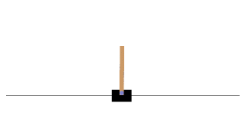

#### SC3000--Artificial-Intelligence
# Assignment 1: Pole Balancing Cart

Given the instance of thecart pole environment, develope Reinforcement Learning Agent in making decision to balance the pole optimally.
Learning Outcome:
1. Implemented Q-Learning Algorithm using Epsilon-Greedy Q-Learning Algorithm to update Q-Value, Q(s,a)
2. Implemented Penalty Function to punish undesireble action.
3. Finetuned parameters (epsilon value, episodes, learning rate etc) to achieve maximum output score
